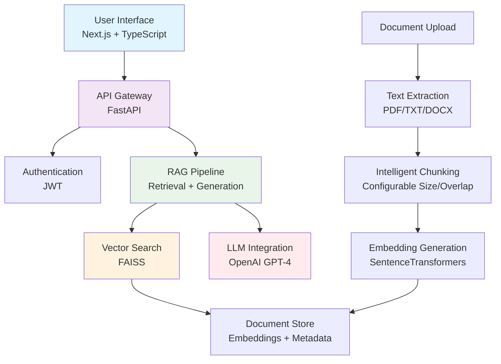

# AI Research & Knowledge Assistant

[](https://opensource.org/licenses/MIT)
[](https://www.python.org/downloads/)
[](https://nextjs.org/)
[](https://openai.com/)

A production-ready, enterprise-grade Retrieval-Augmented Generation (RAG) application for intelligent document analysis and question-answering. Built with modern AI engineering practices, this system provides accurate, source-grounded answers from uploaded documents while maintaining strict hallucination prevention.

## 🎯 Problem Statement

Traditional document analysis tools lack contextual understanding and often provide generic or inaccurate responses. This system addresses the critical need for:

- **Accurate Information Retrieval**: Grounded answers from document context only
- **Scalable Document Processing**: Support for multiple file formats with intelligent chunking
- **Enterprise-Ready Architecture**: Production deployment with monitoring and evaluation
- **User-Centric Design**: Intuitive interface with role-based interactions

## 🏗️ Architecture Overview



### Core Components

- **Frontend**: Next.js 14 with TypeScript, Tailwind CSS
- **Backend**: FastAPI with async processing
- **Vector Database**: FAISS for efficient similarity search
- **Embeddings**: SentenceTransformers (384D vectors)
- **LLM**: OpenAI GPT-4 with strict prompting
- **Authentication**: JWT-based user management
- **Evaluation**: Comprehensive metrics and benchmarking

## 🚀 Key Features

### 🔍 Intelligent Retrieval
- Configurable chunk size and overlap
- Similarity score thresholding
- Top-k re-ranking for precision
- Metadata-enhanced search (document name, page numbers)

### 🧠 Advanced RAG Pipeline
- **Hallucination Prevention**: Answers strictly from context
- **Role-Based Prompting**: Student, Researcher, Interview modes
- **Conversation Memory**: Session-based context retention
- **Source Citations**: Transparent answer provenance

### 📊 Production Monitoring
- End-to-end latency tracking
- Token usage monitoring
- Retrieval performance metrics
- Comprehensive logging

### 🐳 Deployment Ready
- Docker containerization
- Cloud-native configurations
- Health checks and auto-scaling
- Environment-based configuration

## 📈 Evaluation Methodology

The system includes a comprehensive evaluation framework measuring:

### Retrieval Metrics
- **Precision@k**: Accuracy of top-k results
- **Recall@k**: Completeness of relevant document retrieval
- **Mean Reciprocal Rank (MRR)**: Ranking quality
- **Average Precision (AP)**: Precision across recall levels

### Generation Metrics
- **Token Usage**: LLM efficiency tracking
- **Latency**: End-to-end response times
- **Hallucination Detection**: Context adherence validation

### Example Evaluation Results
```
Dataset: 100 Q&A pairs across 50 documents
Precision@5: 0.87
Recall@5: 0.92
MRR: 0.78
Avg Latency: 2.3s
Token Usage: 1,247 avg per query
```

## 🛠️ Technology Stack

| Component | Technology | Version | Purpose |
|-----------|------------|---------|---------|
| **Backend** | FastAPI | 0.104.1 | REST API framework |
| **Frontend** | Next.js | 14.0 | React framework |
| **Language** | Python | 3.11 | Backend processing |
| **Database** | FAISS | 1.9.0 | Vector similarity search |
| **Embeddings** | SentenceTransformers | 2.2.2 | Text vectorization |
| **LLM** | OpenAI GPT-4 | API | Text generation |
| **Auth** | JWT | - | User authentication |
| **Styling** | Tailwind CSS | 3.3.0 | UI components |

## 📋 Prerequisites

- Python 3.11+
- Node.js 18+
- OpenAI API key
- Docker (optional)

## 🚀 Quick Start

### Local Development

1. **Clone and Setup**
   ```bash
   git clone <repository-url>
   cd ai-research-assistant
   ```

2. **Backend Setup**
   ```bash
   cd backend
   python -m venv venv
   source venv/bin/activate  # Windows: venv\Scripts\activate
   pip install -r requirements.txt
   cp .env.example .env
   # Edit .env with your OPENAI_API_KEY and SECRET_KEY
   ```

3. **Frontend Setup**
   ```bash
   cd ../frontend
   pnpm install
   ```

4. **Launch Services**
   ```bash
   # Terminal 1: Backend
   cd backend
   uvicorn main:app --host 0.0.0.0 --port 8001 --reload

   # Terminal 2: Frontend
   cd frontend
   pnpm dev --port 3001
   ```

5. **Access Application**
   - Frontend: http://localhost:3001
   - API Docs: http://localhost:8001/docs

### Docker Deployment

```bash
# Set environment variables
export OPENAI_API_KEY="your-key-here"
export SECRET_KEY="your-secret-key-here"

# Launch with Docker Compose
docker-compose up --build
```

## ☁️ Cloud Deployment

### Backend (Render/Railway/AWS)

1. **Render Deployment**
   ```bash
   # Connect GitHub repo to Render
   # Use render.yaml configuration
   ```

2. **Railway Deployment**
   ```bash
   railway login
   railway link
   railway up
   ```

### Frontend (Vercel)

1. **Connect Repository**
   ```bash
   vercel --prod
   ```

2. **Environment Variables**
   ```
   NEXT_PUBLIC_API_URL=https://your-backend-url
   ```

## 🧪 Testing the Application

### Upload Documents
1. Open http://localhost:3001 in your browser
2. Click "Upload Document" and select a PDF, TXT, or DOCX file
3. Wait for processing confirmation (check backend logs for progress)
4. Verify file appears in the document list

### Test RAG Chat
1. In the chat interface, ask questions about your uploaded documents
2. Example: "What are the main points discussed in the document?"
3. For unrelated questions: "What is the weather today?" (should respond with "not found in documents")
4. Check response sources for document citations

### Verify Logs
- Backend logs show: upload start/end, text extraction, chunking, embeddings, FAISS storage
- No 500 errors or exceptions in logs
- Chat logs show retrieval count and context injection

### Troubleshooting
- If upload fails: Check file format (PDF/TXT/DOCX only), file size, backend logs
- If chat doesn't answer: Ensure documents are uploaded, check similarity threshold
- CORS errors: Verify ports (frontend 3001, backend 8001)
- Auth disabled temporarily for testing core functionality

## 📊 API Reference

### Authentication Endpoints

```http
POST /auth/register
Content-Type: application/json

{
  "username": "researcher",
  "email": "user@example.com",
  "password": "securepassword"
}
```

```http
POST /auth/login
Content-Type: application/json

{
  "username": "researcher",
  "password": "securepassword"
}
```

### Document Management

```http
POST /upload
Content-Type: multipart/form-data

file: [PDF/TXT/DOCX file]
```

### Chat Interface

```http
POST /chat
Authorization: Bearer <jwt-token>
Content-Type: application/json

{
  "message": "What is machine learning?",
  "session_id": "optional-session-id",
  "role": "researcher",
  "top_k": 5,
  "similarity_threshold": 0.5
}
```

### Response Format

```json
{
  "response": "Machine learning is a subset of artificial intelligence...",
  "sources": [
    {
      "document_name": "ai_fundamentals.pdf",
      "page_number": 15,
      "content": "Machine learning enables computers to learn...",
      "score": 0.87
    }
  ],
  "session_id": "session-uuid"
}
```

## 🔬 Evaluation & Benchmarking

Run the evaluation suite:

```bash
cd backend
python evaluation/example_evaluation.py
```

This generates:
- `evaluation_results.csv`: Detailed per-query metrics
- Console output: Average performance metrics
- Latency and token usage statistics

## 🏢 Production Considerations

### Security
- JWT token expiration (30 minutes)
- CORS configuration for production domains
- Input validation and sanitization
- Secure API key management

### Scalability
- Async processing for document uploads
- FAISS index optimization for large datasets
- Connection pooling for external APIs
- Horizontal scaling with load balancers

### Monitoring
- Structured logging with performance metrics
- Health check endpoints
- Error tracking and alerting
- Usage analytics

## 🤝 Contributing

1. Fork the repository
2. Create a feature branch (`git checkout -b feature/amazing-feature`)
3. Commit changes (`git commit -m 'Add amazing feature'`)
4. Push to branch (`git push origin feature/amazing-feature`)
5. Open a Pull Request

### Development Guidelines
- Follow PEP 8 for Python code
- Use TypeScript strict mode
- Write comprehensive docstrings
- Add unit tests for new features
- Update documentation

## 📄 License

This project is licensed under the MIT License - see the [LICENSE](LICENSE) file for details.

## 🙏 Acknowledgments

- OpenAI for GPT-4 API
- Hugging Face for SentenceTransformers
- Meta for FAISS vector search
- FastAPI and Next.js communities

## 📞 Support

For questions or issues:
- Create an issue on GitHub
- Check the API documentation at `/docs`
- Review the evaluation metrics for performance insights

---

**Built with ❤️ for the AI research community**